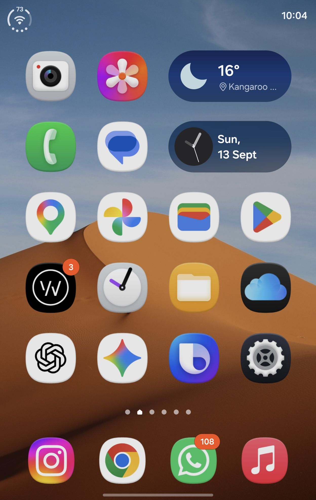
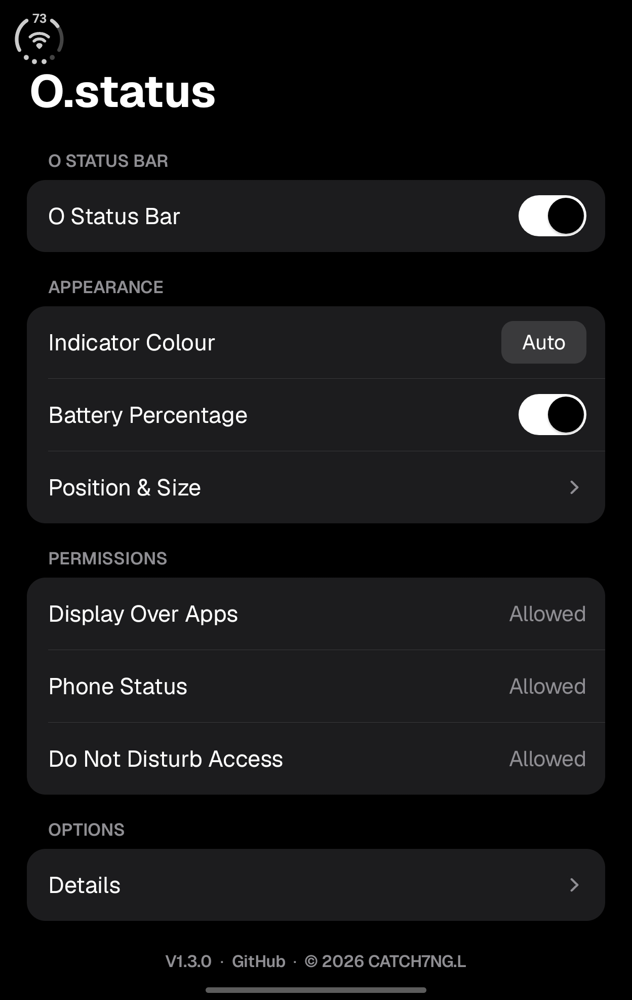

# O.status

A clean and minimal Android status indicator for cellular, Wi-Fi and battery status.

  

## ⚙️ Recommended Setup

For the cleanest O.status experience, it is recommended to hide your phone's original **Wi-Fi, Mobile Signal and Battery icons** from the system status bar.

The method varies depending on your Android device and manufacturer.

### Samsung Galaxy

On Samsung One UI, you can use **Good Lock → QuickStar → Visibility of Indicator Icons** to hide the original:

- Wi-Fi
- Mobile Signal
- Battery

You can also move or adjust the system clock in QuickStar to better match your preferred O.status position.

> O.status does not automatically modify or remove your system status bar icons.

## ✨ Features

- Real-time Wi-Fi signal strength
- Default Data SIM signal strength
- 4G / 5G network status
- Battery level and Battery Percentage
- Automatic battery percentage display at 20% or below
- Charging and fully charged battery status
- Low battery and Power Saving status
- Automatic Light / Dark Mode appearance
- Manual Black / White indicator colour
- Left / Right positioning
- Adjustable position and size
- Do Not Disturb avoidance
- Pixel Shifting to help reduce the risk of AMOLED burn-in
- Automatic hide in full screen
- Automatic start after reboot
- Background recovery
- Detailed battery, Wi-Fi, mobile and network speed information

  

## 🔐 Permissions

O.status only uses the permissions required for its core functions:

- Display Over Apps
- Phone Status
- Do Not Disturb Access

No Location, Usage Access or Accessibility permission is required.

## 🚀 Latest Version

**O.status v3.0.0**

The method varies depending on your Android device and manufacturer.

### Samsung Galaxy

On Samsung One UI, you can use **Good Lock → QuickStar → Visibility of Indicator Icons** to hide the original:

- Wi-Fi
- Mobile Signal
- Battery

You can also move or adjust the system clock in QuickStar to better match your preferred O.status position.

> O.status does not automatically modify or remove your system status bar icons.

## ✨ Features

- Real-time Wi-Fi signal strength
- Default Data SIM signal strength
- 4G / 5G network status
- Battery level and Battery Percentage
- Automatic battery percentage display at 20% or below
- Green charging and fully charged battery status
- Low battery and Power Saving status
- Dynamic Auto indicator colour with optional Shizuku integration
- Automatic Light / Dark Mode fallback when Shizuku is unavailable
- Manual Black / White indicator colour
- Left / Right positioning
- Adjustable position and size
- Event-driven Do Not Disturb avoidance on the right side
- Pixel Shifting to help reduce the risk of AMOLED burn-in
- Automatic hide in full screen
- Automatic start after reboot
- Background recovery
- Detailed battery, Wi-Fi, mobile and network speed information

  

## 🔐 Permissions

O.status only uses the permissions required for its core functions:

- Display Over Apps
- Phone Status
- Do Not Disturb Access
- Shizuku (optional, for Dynamic Auto indicator colour)

No Location, Usage Access or Accessibility permission is required.

## Shizuku and Dynamic Auto

Shizuku is an optional third-party app. When Shizuku is connected and O.status is authorised, **Auto** can follow the current system status-bar appearance and switch the indicator between black and white dynamically.

Without Shizuku, **Auto** continues to work using the phone's system theme:

- Light Mode → Black indicator
- Dark Mode → White indicator

Manual **Black** and **White** modes do not require Shizuku.

## 🚀 Latest Version

**O.status v3.0.0**

## 📄 Source Code

Source Code Available for Reference.

© 2026 CATCH7NG.L · All Rights Reserved
